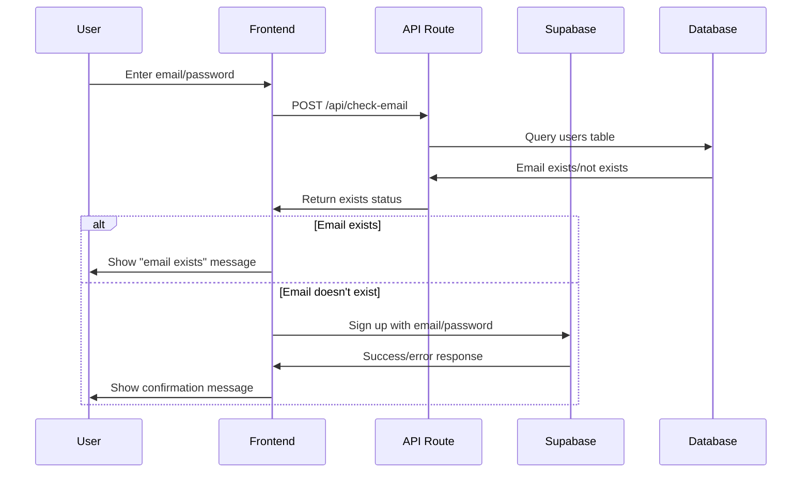
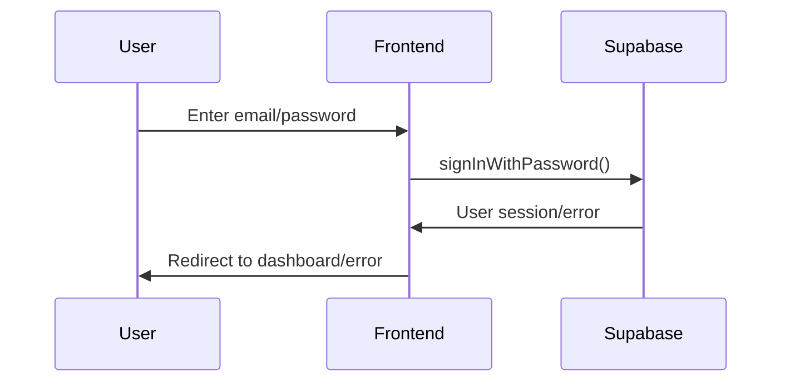

# Backend Documentation - LinkedIn Post Generator

## Overview

This document describes the backend architecture and API endpoints for the LinkedIn Post Generator application. The backend is built using Next.js API routes with Supabase as the database and authentication provider.

## Tech Stack

- **Framework**: Next.js 15.3.5 (App Router)
- **Database**: Supabase PostgreSQL
- **Authentication**: Supabase Auth
- **API**: Next.js API Routes
- **AI Integration**: Cohere AI (Command Model)
- **Language**: TypeScript

## Environment Variables

Create a `.env` file in the root directory:

```env
NEXT_PUBLIC_SUPABASE_URL=https://your-project.supabase.co
NEXT_PUBLIC_SUPABASE_ANON_KEY=your-anon-key
NEXT_PUBLIC_COHERE_API_KEY=your-cohere-key
```

## Database Schema

### Users Table (`public.users`)

The application uses a custom `users` table in addition to Supabase's built-in `auth.users` table.

```sql
-- Example schema (adjust based on your actual table structure)
CREATE TABLE public.users (
  id UUID NOT NULL,
  email TEXT NOT NULL,
  CONSTRAINT users_pkey PRIMARY KEY (id),
  CONSTRAINT users_email_key UNIQUE (email),
  CONSTRAINT users_id_fkey FOREIGN KEY (id) REFERENCES auth.users (id) ON DELETE CASCADE
) TABLESPACE pg_default;

-- Enable Row Level Security
ALTER TABLE public.users ENABLE ROW LEVEL SECURITY;

-- RLS Policies (example)
ALTER POLICY "Enable read access for all users"
ON "public"."users"
TO public
USING (
  true
);
```

### Posts Table

```sql
-- Planned schema for storing generated posts
CREATE TABLE public.posts (
  id BIGINT GENERATED BY DEFAULT AS IDENTITY NOT NULL,
  tone TEXT NULL,
  topic TEXT NULL,
  content TEXT NULL,
  user_id UUID NULL DEFAULT gen_random_uuid(),
  created_at TIMESTAMP WITH TIME ZONE NOT NULL DEFAULT NOW(),
  CONSTRAINT posts_pkey PRIMARY KEY (id),
  CONSTRAINT posts_user_id_fkey FOREIGN KEY (user_id) REFERENCES auth.users (id) ON UPDATE CASCADE ON DELETE SET NULL
) TABLESPACE pg_default;

-- Enable RLS
ALTER TABLE public.posts ENABLE ROW LEVEL SECURITY;

-- RLS Policies
CREATE POLICY "Enable users to view their own data only"
ON "public"."posts"
FOR SELECT
TO authenticated
USING (
  (SELECT auth.uid()) = user_id
);

CREATE POLICY "Enable insert for authenticated users only"
ON "public"."posts"
FOR INSERT TO authenticated
WITH CHECK (true);

CREATE POLICY "Enable insert for users based on user_id"
ON "public"."posts"
FOR INSERT WITH CHECK (
  (SELECT auth.uid()) = user_id
);

CREATE POLICY "Enable delete for users based on user_id"
ON "public"."posts"
FOR DELETE USING (
  (SELECT auth.uid()) = user_id
);
```

## API Routes

### 1. Email Existence Check

**Endpoint**: `POST /api/check-email`

**Purpose**: Check if an email already exists in the `public.users` table before signup.

**Request Body**:
```json
{
  "email": "user@example.com"
}
```

**Response**:
```json
{
  "exists": true
}
```

**Error Response**:
```json
{
  "error": "Email is required"
}
```

**Implementation**: `app/src/app/api/check-email/route.ts`

```typescript
// Key features:
// - Uses Supabase client to query public.users table
// - Handles PGRST116 error (no rows found) gracefully
// - Comprehensive error logging for debugging
// - Returns boolean indicating email existence
```

### 2. Post Generation (Future)

**Endpoint**: `POST /api/generate-post`

**Purpose**: Generate LinkedIn posts using Cohere AI.

**Request Body**:
```json
{
  "topic": "AI in healthcare",
  "tone": "Professional",
  "targetReaction": "Like",
  "targetAudience": "Healthcare professionals"
}
```

**Response**:
```json
{
  "content": "Generated LinkedIn post content...",
  "success": true
}
```

## Authentication Flow

### 1. Signup Process



### 2. Login Process



## Security Considerations

### 1. Row Level Security (RLS)

- All database tables have RLS enabled
- Users can only access their own data
- Policies use `auth.uid()` for user identification

### 2. API Security

- Environment variables for sensitive data
- Input validation on all API routes
- Error handling without exposing internal details
- CORS configuration (if needed for production)

### 3. Authentication

- Supabase handles JWT token management
- Automatic session refresh
- Secure password requirements enforced

## Error Handling

### API Error Responses

```typescript
// Standard error response format
{
  "error": "Human readable error message",
  "details": "Technical details (optional)"
}
```

### Common Error Codes

- `400`: Bad Request (missing required fields)
- `401`: Unauthorized (invalid credentials)
- `403`: Forbidden (insufficient permissions)
- `500`: Internal Server Error (server issues)

## Development Setup

### 1. Install Dependencies

```bash
npm install
```

### 2. Environment Setup

```bash
# Copy environment template
cp .env.example .env.local

# Fill in your Supabase credentials
NEXT_PUBLIC_SUPABASE_URL=your_supabase_url
NEXT_PUBLIC_SUPABASE_ANON_KEY=your_anon_key
NEXT_PUBLIC_COHERE_API_KEY=your_cohere_key
```

### 3. Database Setup

1. Create a Supabase project
2. Create the `users` table with appropriate schema
3. Enable RLS and create policies
4. Test the email existence check API

### 4. Run Development Server

```bash
npm run dev
```

## Testing

### API Testing

```bash
# Test email existence check
curl -X POST http://localhost:3000/api/check-email \
  -H "Content-Type: application/json" \
  -d '{"email": "test@example.com"}'
```

### Database Testing

```sql
-- Test users table
SELECT * FROM public.users WHERE email = 'test@example.com';

-- Test RLS policies
-- (Run as authenticated user)
SELECT * FROM public.users;
```

## Deployment

### Vercel Deployment

1. Push code to GitHub
2. Connect repository to Vercel
3. Add environment variables in Vercel dashboard
4. Deploy

### Environment Variables for Production

- `NEXT_PUBLIC_SUPABASE_URL`: Your Supabase project URL
- `NEXT_PUBLIC_SUPABASE_ANON_KEY`: Your Supabase anon key
- `NEXT_PUBLIC_COHERE_API_KEY`: Your Cohere API key

## Monitoring and Logging

### API Logging

The backend includes comprehensive logging:

```typescript
// Example log output
console.log('Checking email existence for:', email);
console.log('Supabase URL:', supabaseUrl);
console.log('Query result - data:', data);
console.log('Query result - error:', error);
```

### Error Tracking

- All API errors are logged with details
- Database errors include error codes and messages
- Client-side errors are captured and logged

## Future Enhancements

### Planned Features

1. **Post Storage**: Save generated posts to database
2. **User Dashboard**: View post history
3. **Post Analytics**: Track engagement metrics
4. **Rate Limiting**: Prevent API abuse
5. **Caching**: Cache AI responses for performance
6. **Webhooks**: Real-time notifications

### API Extensions

```typescript
// Planned API routes
POST /api/posts          // Save generated post
GET  /api/posts          // Get user's posts
PUT  /api/posts/:id      // Update post
DELETE /api/posts/:id    // Delete post
GET  /api/analytics      // Get usage statistics
```

## Troubleshooting

### Common Issues

1. **Environment Variables Not Found**
   - Check `.env.local` file exists
   - Verify variable names match exactly
   - Restart development server

2. **Database Connection Errors**
   - Verify Supabase URL and key
   - Check network connectivity
   - Ensure database is accessible

3. **RLS Policy Issues**
   - Verify policies are correctly configured
   - Check user authentication status
   - Test with authenticated requests

### Debug Mode

Enable detailed logging by setting:

```typescript
// In API routes
console.log('Debug mode enabled');
console.log('Request body:', request.body);
console.log('Environment check:', { supabaseUrl, supabaseAnonKey });
```

## Contributing

1. Follow TypeScript best practices
2. Add comprehensive error handling
3. Include logging for debugging
4. Test API endpoints thoroughly
5. Update this documentation for new features

---

**Last Updated**: July 2025  
**Version**: 1.0.0 